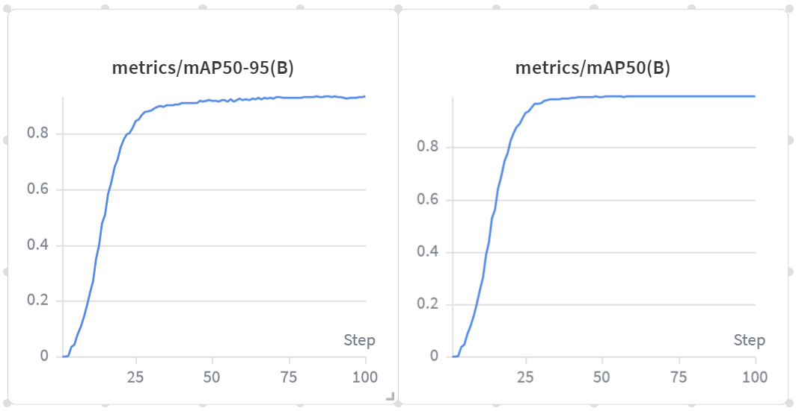

# Hanafuda Card Detection with YOLO11

Detect all 36 Hanafuda (花札) playing card classes (48 unique cards) from photos using YOLO11n,
trained on a custom dataset and tracked with Weights & Biases.

[](https://www.python.org/)
[](LICENSE)
[](https://huggingface.co/datasets/tarumino3/Hanafuda-Object-Detection)
[](https://github.com/ultralytics/ultralytics)

---

## Demo


**Training Metrics (YOLO11n, 100 epochs)**



---

## Overview

[Hanafuda](https://en.wikipedia.org/wiki/Hanafuda) (花札, "flower cards") is a traditional Japanese playing card game.
Each of the 48 cards depicts a plant associated with a specific month.
This project trains a YOLO11n object detector to recognise 36 card classes
from photos taken in real-game conditions.

**Why YOLO?** Cards are small, can overlap, and may appear at any angle.
YOLO's single-pass architecture handles all of this efficiently.

---

## Quick Start

```bash
# 1. Clone the repository
git clone https://github.com/tarumino3/Hanafuda-YOLO.git
cd Hanafuda-YOLO

# 2. Install dependencies
pip install -r requirements.txt

# 3. Place best.pt in models/  

# 4. Run inference on an image
python -m src.inference --model models/best.pt --image your_image.jpg

# 5. Save the annotated result
python -m src.inference --model models/best.pt --image your_image.jpg --output result.jpg
```

---

## Dataset

The dataset contains annotated images of Hanafuda cards in YOLO format,
hosted on Hugging Face.

- **Link:** <https://huggingface.co/datasets/tarumino3/Hanafuda-Object-Detection>
- **Classes:** 36
- **Format:** YOLO (normalised `xywh` txt labels)
- **Split:** 80% train / 20% val

```bash
hf download tarumino3/Hanafuda-Object-Detection --repo-type dataset --local-dir data
```

See [data/README.md](data/README.md) for full setup instructions and the
expected directory structure.

---

## Training

```bash
# GPU (recommended)
python -m src.train --epochs 100 --device 0

# CPU only
python -m src.train --epochs 100 --device cpu

# Show all options
python -m src.train --help
```

Training logs are automatically synced to Weights & Biases.
To disable WandB: pass `--no-wandb`.

---

## Results

| Model | Params | mAP50 | mAP50-95 | Precision | Recall | Inference (CPU) |
|-------|--------|-------|----------|-----------|--------|-----------------|
| YOLO11n | 2.6M | **99.5%** | **93.5%** | 99.0% | 99.1% | 219 ms/img |

Training: 100 epochs · 9.7 hours · Google Colab (Tesla T4)

---

## Class List

<details>
<summary>All 36 classes (click to expand)</summary>

| Month | Plant | Classes |
|-------|-------|---------|
| 01 January | Pine (松) | `01-hkr-tsuru`, `01-kas`, `01-tan-akatan` |
| 02 February | Plum (梅) | `02-kas`, `02-tan-akatan`, `02-tne-uguisu` |
| 03 March | Cherry (桜) | `03-hkr-maku`, `03-kas`, `03-tan-akatan` |
| 04 April | Wisteria (藤) | `04-kas`, `04-tan-muji`, `04-tne-hototogisu` |
| 05 May | Iris (菖蒲) | `05-kas`, `05-tan-muji`, `05-tne-yatsuhashi` |
| 06 June | Peony (牡丹) | `06-kas`, `06-tan-aotan`, `06-tne-cho` |
| 07 July | Bush Clover (萩) | `07-kas`, `07-tan-muji`, `07-tne-inoshishi` |
| 08 August | Susuki Grass (芒) | `08-hkr-tsuki`, `08-kas`, `08-tne-kari` |
| 09 September | Chrysanthemum (菊) | `09-kas`, `09-tan-aotan`, `09-tne-sakazuki` |
| 10 October | Maple (紅葉) | `10-kas`, `10-tan-aotan`, `10-tne-shika` |
| 11 November | Rain (雨) | `11-hkr-michikaze`, `11-kas`, `11-tan-muji`, `11-tne-tsubame` |
| 12 December | Paulownia (桐) | `12-hkr-hooh`, `12-kas` |

Card type prefixes: `hkr` = 光 (hikari, bright) · `tne` = 種 (tane, animal) · `tan` = 短冊 (tanzaku, ribbon) · `kas` = カス (kasu, plain)

</details>

---

## Project Structure

```
Hanafuda-YOLO/
├── .gitignore
├── README.md
├── requirements.txt
├── LICENSE                          # AGPL-3.0
│
├── data/
│   └── README.md                    # Dataset download instructions
│
├── models/
│   └── best.pt                      # Trained weights
│
├── src/
│   ├── __init__.py
│   ├── train.py                     # Training CLI
│   ├── inference.py                 # HanafudaDetector class + inference CLI
│   └── utils.py                     # CLASS_NAMES, TrainConfig, draw_detections
│
├── notebooks/
│   └── 01_quickstart_demo.ipynb    # Interactive demo
│
└── assets/
    ├── demo_result.png
    └── wandb_metrics.png
```

---

## License

This project is licensed under the [GNU Affero General Public License v3.0](LICENSE).
